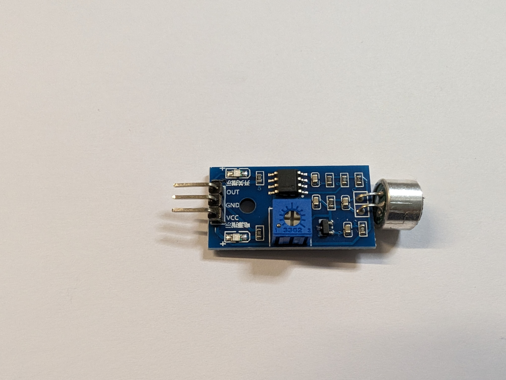
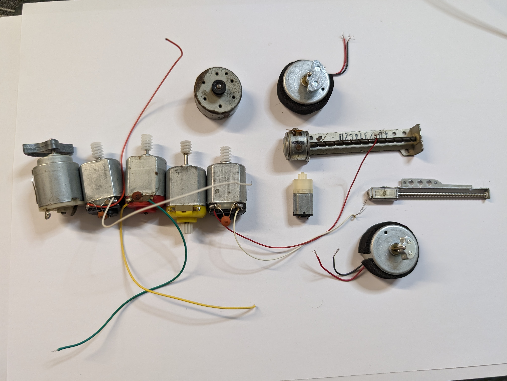

# arduino-uno-projects

Arduino Uno testing &amp; catalog

## Devices

### Arduino Uno R4 (wifi) 

### Arduino Uno R3

## IDEs

- Arduino IDE
- Arduino Cloud
- VS Code (when using [Johnny-Five.js](https://johnny-five.io/))

## Modules &amp; Components

| Image | Description |
|-------|-------------|
|  | OLED 0.91inch 128x32 |
|  | Hc06 Bluetooth Module |
|  | 1 x Laser Diode Module 650nm 5v Laser Light Module Ky008 & 2 x 650nm 6mm 3v 5mw Laser Dot Diode Laser Diode |
|  | Dual Axis Xy Analog Joystick Module Ky 023 2 Axis Ps2 Joystick Control Lever Breakout |
|  | DHT11 Temperature And Humidity Sensor |
|  | KY038 Sound Detector module |
|  | Hc Sr04 Ultrasonic Sensor |
|  | Common Anode 4 Digit 7 Segment Red Led Display & Common Anode 1 Digit 7 Segment Red Led Display |
|  | Solid State Relay Ssr Module 1 Channel & 2 Channel Relay Module Relay |
|  | Jumper Wires |
|  | 2 x Infrared Obstacle Avoidance Sensor Module |
|  | Mg996r Metal Gear Servo Motor 360, Sg 90 180 Degree Servo Motor & Mg90s Mini Digital 180 Degree Servo Motor |
|  | 4 x 68RPM N20 DC Gear Motor, DC 2V TO 24V 5100 RPM Motor & Coreless Micro DC Motor |
|  | 100k Variable Resistor Potentiometer Volume Type, 10k Variable Resistor Potentiometer Volume Type & Ky-040 Rotary Encoder Sensor Module With Push Button |
|  | Push Buttons |
|  | Active Piezo Buzzer 3v To 12V |
|  | IR Remote, IR LED Transmitter & IR Sensor Receiver Module |
|  | 1watt RGB LED Module & RGB LED Sensor Module |
|  | Gy521 Mpu6050 3 Axis Digital Gyroscope Accelerometer Sensor Module |
|  | L298N Based Motor Driver Module |
|  | Multi-color LEDs & IC RGB LEDs |
|  | Green Color 1602 Character Lcd Display 16x2 |
|  | 28byj48 5v Stepper Motor With Uln2003 Driver |
|  | 2 x 3W Ultraviolet LED (UV 700mA / DC 3V-3.2V / 3 Watt) with Heat Sink |
|  | Mb102 Breadboard 830 Points with Mb102 Breadboard Power Supply Module 3.3v/5v |
|  | 12 UV LED IC |
|  | Various DC Motors |
|  | 2 x Alligator clip + 4mm Banana plug |
|  | Ionizer Negative Ion Generator Module |
|  | Air Quality Sensor Module |
|  | Lithium Ion Cells |
|  | A1015 Pnp Transistor |
|  | Tip122 Npn Darlington Transistor |
|  | Resistor Pack Of 15 Values 10r,47r,100r,220r,330r,470r,1k,2.2k,4.7k,6.8k,10k,22k,47k,100k,220k |
